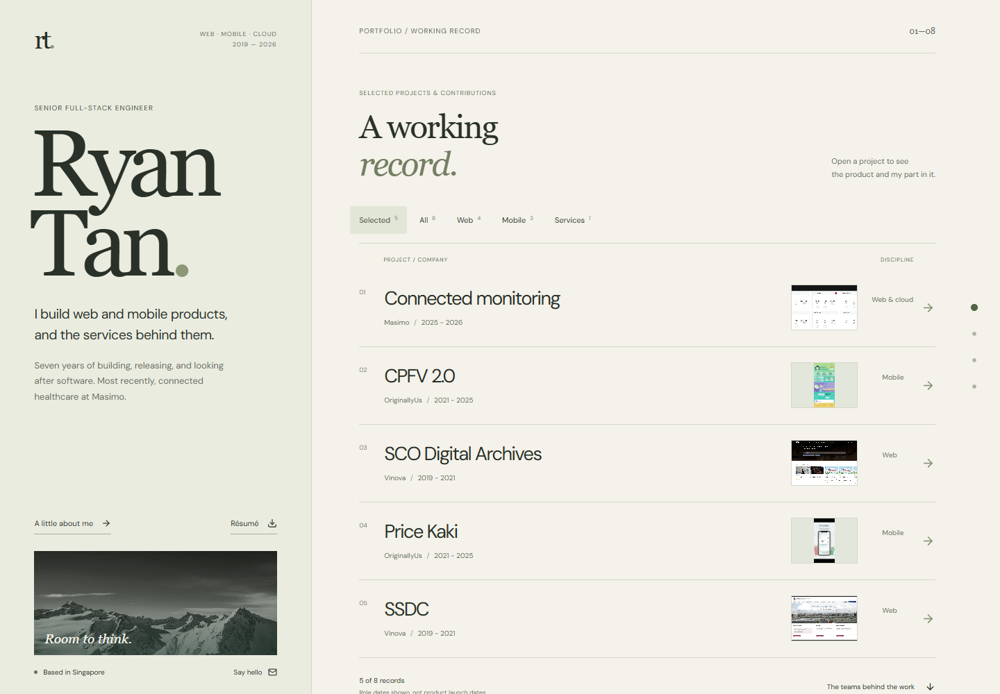

# Ryan Tan — Portfolio

I'm Ryan, a senior full-stack engineer in Singapore. This is a selection of my work at Masimo, OriginallyUs, and Vinova.

[Website](https://ryantan.vercel.app/) · [GitHub](https://github.com/ryantanio) · [Email](mailto:ryantan.htn@gmail.com)



Browse five selected projects or open the full index of eight. Each entry covers the product, my involvement, and its timeline, with public screenshots and links. You'll also find my work history, technical background, and contact details.

Built with **React, TypeScript, Vite, and Tailwind CSS**. Local fonts and images; no backend or environment variables.

## Development

```sh
npm ci
npm run dev
npm run build
npm test
```

Use `npm.cmd` in PowerShell if its script policy blocks `npm`. Browser tests use installed Google Chrome. With the dev server running, `node scripts/capture.mjs` refreshes the README screenshot.

[Project sources and chronology](docs/project-research.md) · [Design concept and references](docs/design-research.md)

Navigation inspired by [Brittany Chiang v2](https://v2.brittanychiang.com/). Alps photograph by [Dennis Maliepaard](https://unsplash.com/photos/grayscale-photography-of-mountain-HJLlOcoFJcw). Product images are credited in their respective records.
